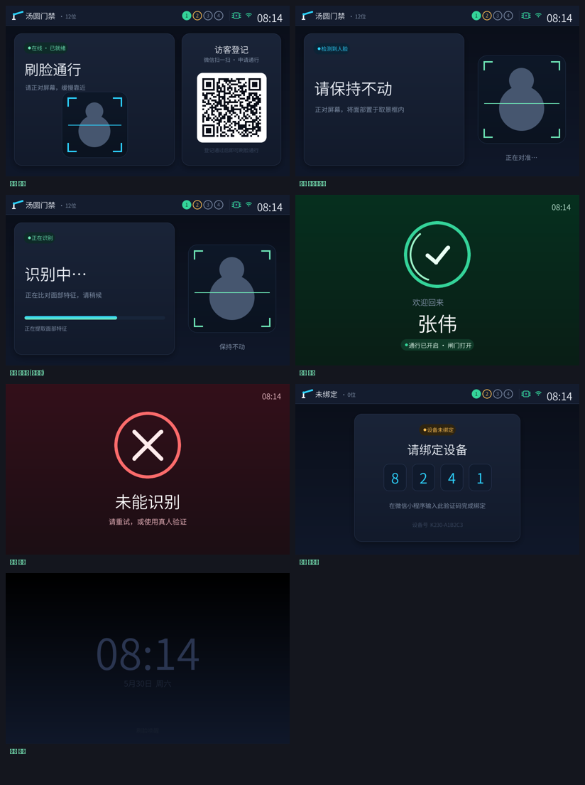

# lvgl-preview

A **Claude Code skill** for designing embedded **LVGL** (MicroPython) UIs with a tight
visual feedback loop: write a `build(scr)` function, render it headless to a PNG on your
computer, and have the agent *read the image* to confirm the result — no device, no
browser, no flashing. Edit, render, look, iterate in seconds.

Auto-adapts to **LVGL 8.x and 9.x** (fonts / `line` / `qrcode` / display binding branch on
version), so the same `build(scr)` runs on a v8 desktop preview *and* a v9 device like the
**K230 CanMV**.



> The gallery above is the K230 vision-gate access-control UI (standby / detecting /
> extracting / success / failure / binding / sleep) — designed entirely through this
> skill's desktop preview, then deployed pixel-faithfully to the real ST7701 panel.

## Why

Iterating on an embedded LCD UI normally means flash → look at the panel → repeat, which is
slow and invisible to an AI agent. This skill renders the **LVGL widget tree** through a
headless `lv_micropython` (SDL unix port) straight to a PNG, so:

- **Edit → render → read PNG → iterate** in seconds, no hardware in the loop.
- An AI agent can *see* its own UI and self-correct.
- The exact same UI code ships to the device (only display init changes).

## Install

Clone once, then `install.sh` **symlinks** the repo into your Claude Code skills dir — so
you develop in this one repo and every project picks up edits live (no copy, no re-sync):

```bash
git clone https://github.com/zhoushoujianwork/lvgl-preview-skill.git
cd lvgl-preview-skill
./install.sh                      # -> ~/.claude/skills/lvgl-preview (all projects)
./install.sh --project /path/app  # -> <app>/.claude/skills/lvgl-preview (one project)
./install.sh --uninstall          # remove the link
```

The skill triggers on phrases like "lvgl preview", "渲染 LVGL", "embedded UI preview".

> ⚠️ **Symlink caveat for on-device dev:** `mpremote mount` does **not** follow symlinks.
> If you mount a dir that imports `lvkit`, the mounted dir needs a **real** `lvkit.py`
> (copy `lib/lvkit.py` in before mounting — see your device runner). The symlink install
> above is for the host-side skill + desktop renderer, which follow symlinks fine.

## Quickstart

1. Build the desktop runtime once (needs SDL2 + a C toolchain):

   ```bash
   bash scripts/build_runtime.sh            # LVGL v8 (release/v8), default
   # bash scripts/build_runtime.sh ~ v9     # or LVGL v9 (master)
   export LVMP_BIN=$HOME/lv_micropython/ports/unix/micropython
   ```

   macOS arm64 / clang17 pitfalls are baked into the script. Linux: `apt install libsdl2-dev`.

2. Write a UI module exposing `build(scr, **state)` (see `templates/ui_example.py`).

3. Render it:

   ```bash
   python3 scripts/lvgl_preview.py templates/ui_example.py --out preview.png --size 480x800
   ```

4. Open `preview.png`. Adjust, re-render, repeat.

## What's inside

```
lvgl-preview/
  SKILL.md                  # the skill spec (Claude Code reads this)
  scripts/
    lvgl_preview.py         # host orchestrator: find binary -> render -> PNG
    render.py               # headless renderer, auto-detects LVGL v8/v9 disp binding
    raw2png.py              # BGRA frame -> PNG (Pillow)
    build_runtime.sh        # build lv_micropython unix (v8 or v9)
  lib/
    lvkit.py                # version-aware primitives + CJK FreeType font helper
  templates/
    ui_example.py           # minimal build(scr) starter
  docs/
    device-binding.md       # copy-paste v8/v9 disp binding + CJK + screenshot-readback
  examples/
    k230-access-control-7screens.png   # real-hardware showcase
```

## The v8 / v9 story

The renderer and `lvkit.py` detect the LVGL major version once
(`_V8 = hasattr(lv, "disp_drv_t")`) and branch the parts that differ between 8.x and 9.x:

| | LVGL 8.x | LVGL 9.x |
|---|---|---|
| display | `disp_draw_buf_t` + `disp_drv_t` | `disp_create` + `set_draw_buffers` |
| CJK font | `ft_info_t().font_init()` | `freetype_font_create(ttf, size, 0)` |
| line points | `point_t` | `point_precise_t` |
| qrcode | ctor args | object + setters |

Your `build(scr)` uses the `lvkit` wrappers, so it stays version-agnostic. Going to a real
device is just swapping the display init — `docs/device-binding.md` has the validated
v8 and v9 snippets (plus CJK fonts and a screenshot-readback trick for headless debugging).

## Requirements

- A C toolchain + SDL2 (for `lv_micropython` unix). macOS: `brew install sdl2`. Linux: `libsdl2-dev`.
- Python 3 with Pillow (`pip3 install Pillow`) for the PNG conversion.

## License

MIT — see [LICENSE](LICENSE). LVGL and lv_micropython are MIT-licensed by their authors.
